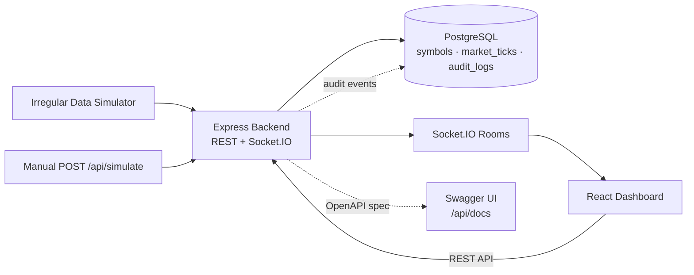
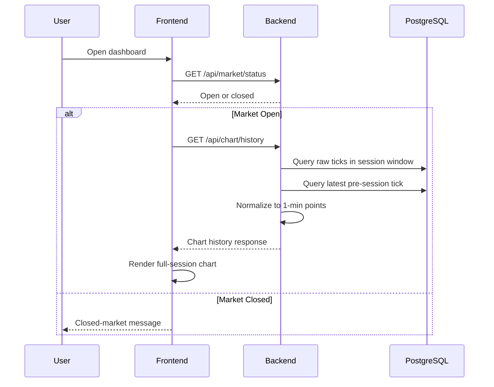
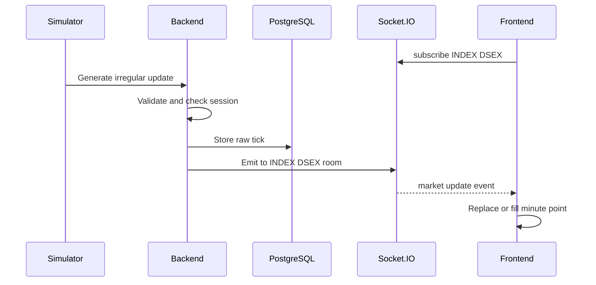

# Architecture

## System Overview

WingsFin Real-Time Market Dashboard is a full-stack system for visualizing live index and stock price data. It displays real-time line charts with 1-minute granularity, reference lines, color-coded points, and live heartbeat animations.

The system consists of three runtime services:

- **React Frontend** — Vite-based SPA that fetches historical data, subscribes to live updates, and renders ECharts time-series charts.
- **Express Backend** — REST API + Socket.IO server that handles market status, data validation, raw tick storage, minute-level normalization, simulation, real-time fanout, an OpenAPI/Swagger UI, and a persisted financial audit trail.
- **PostgreSQL** — Stores symbol metadata, raw market ticks, and audit events with indexes optimized for symbol+time range queries.

## Architecture Diagram

## Main Components

### Backend Modules

| Module | Responsibility |
|---|---|
| `health` | Health endpoint with DB connectivity check (`SELECT 1`) |
| `market` | Market open/close status + 1-second market clock that emits `market:closed` |
| `symbols` | Symbol metadata CRUD with in-memory TTL cache |
| `chart` | Historical chart data normalized to 1-minute points with TTL cache |
| `simulator` | Irregular random-walk data generator + manual ingestion endpoints for INDEX and STOCK |
| `realtime` | Socket.IO server with room-based subscriptions per symbol |
| `audit` | Financial audit trail: in-memory ring buffer + persisted `audit_logs`, queryable via `/api/audit/events` |

The backend also serves an interactive **Swagger UI at `/api/docs`** from a hand-authored OpenAPI 3.0 spec (`config/swagger.ts`).

### Frontend Structure

| Layer | Responsibility |
|---|---|
| `api/` | Typed fetch wrappers for REST endpoints |
| `hooks/` | TanStack Query hooks + Socket.IO lifecycle hook |
| `components/` | Dashboard, chart, dropdown, loading/error states |
| `utils/` | Minute math, color mapping, live update merge, tooltip formatting |

## Data Flow

### Historical Data Flow

### Live Update Flow

## Database Design

### `symbols` Table

Stores instrument metadata. Each symbol has a unique identifier, type (INDEX/STOCK), display name, and yesterday's closing value.

### `market_ticks` Table

Stores every raw update as-received. This preserves the full data lineage and allows rebuilding normalized minute data at any time. Fields include event timestamp, current value, yesterday close, and the original JSON payload.

### `audit_logs` Table

Stores the financial/operational audit trail: API requests, persisted/emitted ticks, simulator lifecycle, and market open/close transitions. Fields include category, action, actor, severity, optional symbol/value/duration, and a JSON `meta` payload. Writes are best-effort and never block the request path.

### Indexes

- `market_ticks (symbol, event_time DESC)` — Optimizes queries filtering by symbol within a time range.
- `market_ticks (event_time DESC)` — Supports global time-range scans.
- `audit_logs (timestamp DESC)`, `(category, timestamp DESC)`, `(symbol, timestamp DESC)` — Support filtered audit queries.

## Time Normalization Strategy

The backend normalizer converts irregular raw ticks into one chart point per minute:

1. Determine session start/end from configured market timezone and hours.
2. Floor current time to the minute boundary.
3. Query all raw ticks within the session window.
4. Query the latest tick before session start as a fallback value.
5. Group ticks by minute key (timezone-aware).
6. Iterate each minute from session start to current minute:
   - If ticks exist for that minute, use the latest one by `event_time`.
   - Otherwise, carry forward the previous known value.
   - If no previous value exists, use the fallback tick or yesterday close.
7. Compute `status` (above/below/equal) by comparing each value against yesterday close.

All timezone conversions use Luxon with the configured `MARKET_TIMEZONE`.

## Market Status Handling

Market open/close is determined at request time by comparing the current time (in configured timezone) against `MARKET_OPEN_TIME` and `MARKET_CLOSE_TIME`. The market is considered open when `currentTime >= sessionStart && currentTime < sessionEnd`.

When the market closes:
- The simulator stops generating new ticks.
- A `market:closed` event is emitted to all connected Socket.IO clients by the **market clock** (`market.clock.ts`), a 1-second heartbeat that is independent of the simulator. This guarantees the closed signal fires even when `SIMULATOR_ENABLED=false`.
- The frontend shows a closed-market message instead of charts.

## Audit Trail & Observability

The backend records a financial-grade audit trail through a single `logAuditEvent()` helper. Each event carries a category (`MARKET_DATA`, `SIMULATOR`, `REALTIME`, `SESSION`, `SYSTEM`, `API`), an action, an actor, a severity, and an optional symbol/value/duration plus a JSON `meta` payload. Events are produced at every meaningful boundary:

- **API layer** — an Express middleware assigns each `/api` request an `X-Request-Id`, then logs an `API_REQUEST`/`API_ERROR` event on response `finish` with method, path, status, and duration.
- **Market data** — ticks emit `TICK_PERSISTED` and `TICK_EMITTED`.
- **Simulator** — `SIMULATOR_STARTED` / `SIMULATOR_STOPPED` / `SIMULATOR_TICK` (errors).
- **Session** — the market clock emits `MARKET_OPEN` / `MARKET_CLOSED`.

Each event is **dual-written**: synchronously to a 500-entry in-memory ring buffer (for fast recent reads and zero-dependency operation) and asynchronously to the `audit_logs` table. The DB write is best-effort — a failure is logged but never breaks the request or tick path. Persisted events are queryable via `GET /api/audit/events` with `category`, `severity`, `symbol`, `from`, `to`, and `limit` filters (rate-limited to 60/min).

## API Documentation

An interactive **Swagger UI is served at `/api/docs`**, backed by a hand-authored OpenAPI 3.0 document (`config/swagger.ts`) that describes every endpoint, request/response schema, and error code. CSP is selectively relaxed for the docs route only; Helmet remains active everywhere else.

## Simulation Strategy

The simulator generates irregular updates using a random-walk algorithm:

- **Index (`DSEX`)** — each tick steps by a random delta in **±10**, clamped to **yesterday close ±100** (5100–5300).
- **Stock (`GP`)** — each tick steps by a random delta in **±0.1**, clamped to **yesterday close ±1** (237.88–239.88).
- **Intervals** — each gap is a uniform random value between `SIMULATOR_MIN_INTERVAL_MS` (300 ms) and `SIMULATOR_MAX_INTERVAL_MS` (3000 ms), so updates arrive at unequal intervals of ≤ 3 seconds.
- Updates are generated independently per symbol, only while the market is open. On startup each symbol's state is hydrated from the latest tick already in the current session.
- Manual updates can also be ingested via `POST /api/simulate/index` and `POST /api/simulate/stock` (rate-limited to 120/min), which flow through the exact same validation and persistence path as simulated ticks.

The seed script (`src/seed.ts`) uses the same ranges and deltas to build non-uniform historical data, including skipped minutes and multiple updates within some minutes.

### Note on Fluctuation Magnitude

The assignment fixes the **value range** (±100 for index, ±1 for stock) and asks that the line "fluctuate from that value point so that the fluctuation and color-changing line is more apparent." The per-tick step size (±10 / ±0.1) is a deliberate tuning choice that satisfies this: it produces frequent, visible crossings of the dotted yesterday-close reference line, which is what drives the above/below/equal point colors.

Because the chart shows **one point per minute (the latest tick of that minute)** and ~36 ticks arrive per minute, the displayed minute-to-minute line is intentionally lively rather than smooth. This is by design and is fully spec-compliant. If a calmer line is preferred for a given demo, two levers are available without touching the contract:

- Lower the per-tick `maxDelta` in `simulator.service.ts` / `seed.ts` (e.g. index ±3, stock ±0.03) for a smoother walk.
- Add a mean-reversion term (`value += k·(yesterdayClose − value) + delta`) so the series oscillates around the reference instead of diffusing toward the ±range edges.

Both could be promoted to environment variables (e.g. `SIMULATOR_INDEX_MAX_DELTA`) if runtime tunability becomes a requirement.

## Performance & Caching

### Backend
- **In-memory TTL cache** for symbols (5 minutes) and chart history (10 seconds per symbol+minute key).
- **Cache-Control headers** on market status (5s), symbols (300s).
- **HTTP compression** via gzip middleware.
- **Database indexes** for all symbol+time queries.
- **Socket.IO rooms** ensure updates are only sent to subscribed clients.

### Frontend
- **TanStack Query staleTime** prevents redundant refetches (15s for chart, 10s for status, 5min for symbols).
- **useMemo** on the ECharts option object to avoid full chart rebuilds.
- **Ref-based minute guard** in the advance timer skips no-op state updates.
- **Ref-based socket callbacks** prevent socket reconnections on callback identity changes.

## Scalability Considerations

### Current Architecture (Assignment Scope)
- Single backend instance with in-process simulator.
- Socket.IO in the same process.
- PostgreSQL stores all raw ticks.

### Production Scaling Path
- Move data ingestion/simulator to a separate worker service.
- Use Redis Pub/Sub or Kafka for update fanout between workers and API servers.
- Use the Socket.IO Redis adapter for horizontal scaling of WebSocket servers.
- Partition `market_ticks` by date or symbol for large datasets.
- Add materialized minute aggregates for faster historical chart loads.
- Add CDN/static hosting for the frontend.
- Add observability: Prometheus metrics, structured logging, distributed tracing.

## Technology Choices

| Technology | Rationale |
|---|---|
| Express | Mature, well-supported, easy Socket.IO integration |
| Socket.IO | Built-in rooms, reconnection, fallback transports |
| Prisma | Type-safe queries, automatic migrations, clean schema |
| Luxon | Robust timezone handling required by the market clock |
| Zod | Runtime payload validation with TypeScript inference |
| ECharts | `effectScatter` for heartbeat animation, strong time-axis support |
| TanStack Query | Declarative data fetching with caching and stale management |
| Vite | Fast HMR in development, optimized production builds |
| Pino | Structured JSON logging for production, pretty-print for dev |
| swagger-ui-express | Self-documenting, browsable API contract at `/api/docs` |
| express-rate-limit | Lightweight abuse protection on ingestion and audit-read routes |

## Trade-Offs

| Decision | Trade-off |
|---|---|
| Raw ticks stored instead of aggregates | Higher storage cost but enables full audit trail and chart rebuilds |
| Simulator in-process | Simpler deployment but couples simulation to the API server |
| ECharts over Recharts | Larger bundle size but native effectScatter for heartbeat animation |
| Prisma over raw SQL | Slightly slower than hand-tuned SQL but safer, typed, and maintainable |
| In-memory cache over Redis | Simple for single-instance; would need Redis for multi-instance |
| Socket.IO over native WebSocket | Larger protocol overhead but provides rooms, reconnection, and fallback |
| Audit ring buffer + async DB write | Fast recent reads and non-blocking writes, but the buffer is per-instance and lost on restart (DB is the durable record) |
| Hand-authored OpenAPI spec | Always accurate to intended contract, but must be kept in sync manually as endpoints evolve |

## Future Improvements

- WebSocket authentication with JWT tokens.
- RBAC / auth gating for `/api/docs` and `/api/audit/events`, which are intentionally open during the review phase.
- Ship audit events to a dedicated log pipeline / SIEM and add metrics-based alerting.
- Historical data pagination for sessions with many symbols.
- Materialized minute views for instant history loads.
- Redis-backed caching for multi-instance deployments.
- Separate simulator microservice with message queue.
- Frontend service worker for offline status display.
- E2E tests with Playwright.
- Grafana/Prometheus monitoring dashboard.
