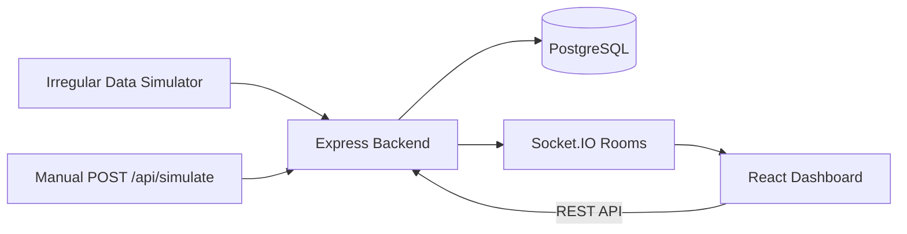
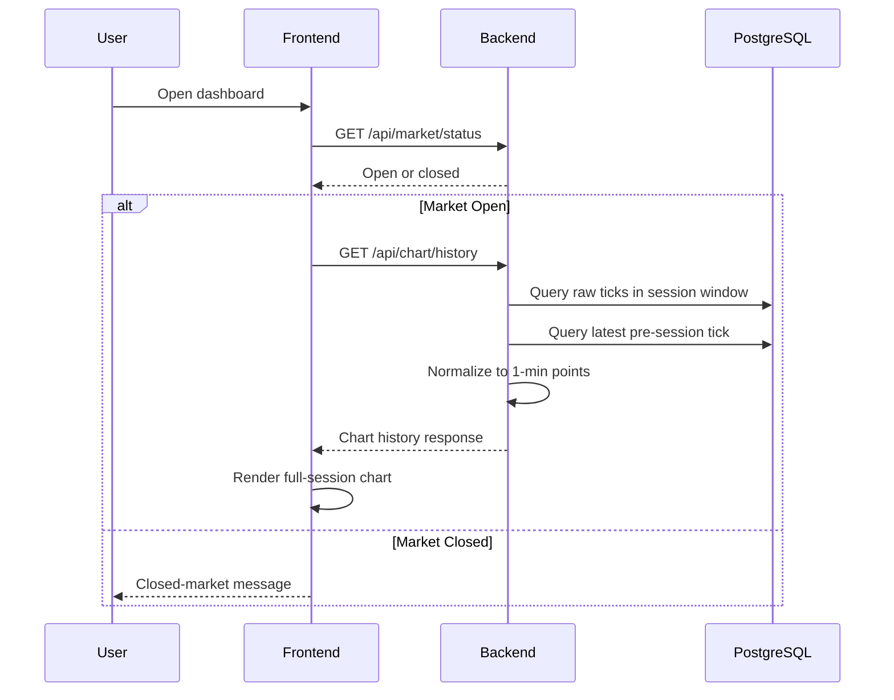
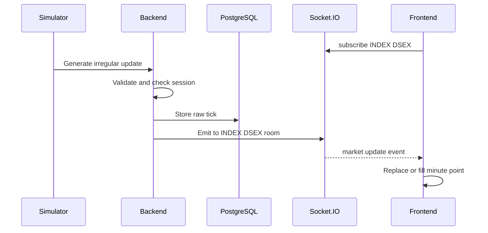

# Architecture

## System Overview

WingsFin Real-Time Market Dashboard is a full-stack system for visualizing live index and stock price data. It displays real-time line charts with 1-minute granularity, reference lines, color-coded points, and live heartbeat animations.

The system consists of three runtime services:

- **React Frontend** — Vite-based SPA that fetches historical data, subscribes to live updates, and renders ECharts time-series charts.
- **Express Backend** — REST API + Socket.IO server that handles market status, data validation, raw tick storage, minute-level normalization, simulation, and real-time fanout.
- **PostgreSQL** — Stores symbol metadata and raw market ticks with indexes optimized for symbol+time range queries.

## Architecture Diagram

## Main Components

### Backend Modules

| Module | Responsibility |
|---|---|
| `health` | Health endpoint with DB connectivity check |
| `market` | Market open/close status based on configured timezone and hours |
| `symbols` | Symbol metadata CRUD with in-memory TTL cache |
| `chart` | Historical chart data normalized to 1-minute points with TTL cache |
| `simulator` | Irregular random-walk data generator for both INDEX and STOCK |
| `realtime` | Socket.IO server with room-based subscriptions per symbol |

### Frontend Structure

| Layer | Responsibility |
|---|---|
| `api/` | Typed fetch wrappers for REST endpoints |
| `hooks/` | TanStack Query hooks + Socket.IO lifecycle hook |
| `components/` | Dashboard, chart, dropdown, loading/error states |
| `utils/` | Minute math, color mapping, live update merge, tooltip formatting |

## Data Flow

### Historical Data Flow

### Live Update Flow

## Database Design

### `symbols` Table

Stores instrument metadata. Each symbol has a unique identifier, type (INDEX/STOCK), display name, and yesterday's closing value.

### `market_ticks` Table

Stores every raw update as-received. This preserves the full audit trail and allows rebuilding normalized minute data at any time. Fields include event timestamp, current value, yesterday close, and the original JSON payload.

### Indexes

- `(symbol, event_time DESC)` — Optimizes queries filtering by symbol within a time range.
- `(event_time DESC)` — Supports global time-range scans.

## Time Normalization Strategy

The backend normalizer converts irregular raw ticks into one chart point per minute:

1. Determine session start/end from configured market timezone and hours.
2. Floor current time to the minute boundary.
3. Query all raw ticks within the session window.
4. Query the latest tick before session start as a fallback value.
5. Group ticks by minute key (timezone-aware).
6. Iterate each minute from session start to current minute:
   - If ticks exist for that minute, use the latest one by `event_time`.
   - Otherwise, carry forward the previous known value.
   - If no previous value exists, use the fallback tick or yesterday close.
7. Compute `status` (above/below/equal) by comparing each value against yesterday close.

All timezone conversions use Luxon with the configured `MARKET_TIMEZONE`.

## Market Status Handling

Market open/close is determined at request time by comparing the current time (in configured timezone) against `MARKET_OPEN_TIME` and `MARKET_CLOSE_TIME`. The market is considered open when `currentTime >= sessionStart && currentTime < sessionEnd`.

When the market closes:
- The simulator stops generating new ticks.
- A `market:closed` event is emitted to all connected Socket.IO clients.
- The frontend shows a closed-market message instead of charts.

## Simulation Strategy

The simulator generates irregular updates using a random-walk algorithm:

- Each tick applies a random delta clamped to the allowed range (±100 for index, ±1 for stock).
- The interval between ticks is random between `SIMULATOR_MIN_INTERVAL_MS` (300ms) and `SIMULATOR_MAX_INTERVAL_MS` (3000ms).
- Updates are generated independently for each symbol.
- The simulator only runs when the market is open.
- Manual updates can also be sent via `POST /api/simulate/index` and `POST /api/simulate/stock`.

## Performance & Caching

### Backend
- **In-memory TTL cache** for symbols (5 minutes) and chart history (10 seconds per symbol+minute key).
- **Cache-Control headers** on market status (5s), symbols (300s).
- **HTTP compression** via gzip middleware.
- **Database indexes** for all symbol+time queries.
- **Socket.IO rooms** ensure updates are only sent to subscribed clients.

### Frontend
- **TanStack Query staleTime** prevents redundant refetches (15s for chart, 10s for status, 5min for symbols).
- **useMemo** on the ECharts option object to avoid full chart rebuilds.
- **Ref-based minute guard** in the advance timer skips no-op state updates.
- **Ref-based socket callbacks** prevent socket reconnections on callback identity changes.

## Scalability Considerations

### Current Architecture (Assignment Scope)
- Single backend instance with in-process simulator.
- Socket.IO in the same process.
- PostgreSQL stores all raw ticks.

### Production Scaling Path
- Move data ingestion/simulator to a separate worker service.
- Use Redis Pub/Sub or Kafka for update fanout between workers and API servers.
- Use the Socket.IO Redis adapter for horizontal scaling of WebSocket servers.
- Partition `market_ticks` by date or symbol for large datasets.
- Add materialized minute aggregates for faster historical chart loads.
- Add CDN/static hosting for the frontend.
- Add observability: Prometheus metrics, structured logging, distributed tracing.

## Technology Choices

| Technology | Rationale |
|---|---|
| Express | Mature, well-supported, easy Socket.IO integration |
| Socket.IO | Built-in rooms, reconnection, fallback transports |
| Prisma | Type-safe queries, automatic migrations, clean schema |
| Luxon | Robust timezone handling required by the market clock |
| Zod | Runtime payload validation with TypeScript inference |
| ECharts | `effectScatter` for heartbeat animation, strong time-axis support |
| TanStack Query | Declarative data fetching with caching and stale management |
| Vite | Fast HMR in development, optimized production builds |
| Pino | Structured JSON logging for production, pretty-print for dev |

## Trade-Offs

| Decision | Trade-off |
|---|---|
| Raw ticks stored instead of aggregates | Higher storage cost but enables full audit trail and chart rebuilds |
| Simulator in-process | Simpler deployment but couples simulation to the API server |
| ECharts over Recharts | Larger bundle size but native effectScatter for heartbeat animation |
| Prisma over raw SQL | Slightly slower than hand-tuned SQL but safer, typed, and maintainable |
| In-memory cache over Redis | Simple for single-instance; would need Redis for multi-instance |
| Socket.IO over native WebSocket | Larger protocol overhead but provides rooms, reconnection, and fallback |

## Future Improvements

- WebSocket authentication with JWT tokens.
- Historical data pagination for sessions with many symbols.
- Materialized minute views for instant history loads.
- Redis-backed caching for multi-instance deployments.
- Separate simulator microservice with message queue.
- Frontend service worker for offline status display.
- E2E tests with Playwright.
- Grafana/Prometheus monitoring dashboard.
