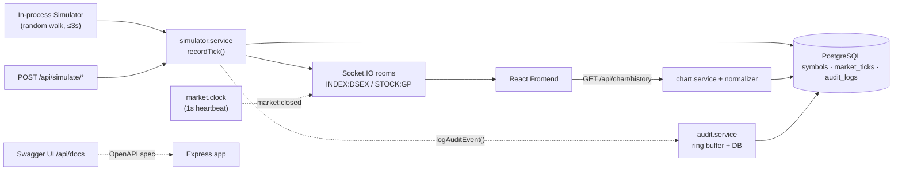

# Backend Code Analysis

This file explains the backend codebase from the point of view of a new engineer reading the project. The backend is an Express + Socket.IO + Prisma service that stores raw market ticks, normalizes them into one-minute chart points, emits live market updates, documents itself through an OpenAPI/Swagger UI, and records a persisted financial audit trail.

## Architecture At A Glance



## Backend Mental Model

The backend has six main responsibilities:

1. Expose HTTP APIs under `/api` (documented at `/api/docs`).
2. Store and read market symbols, raw market ticks, and audit events from PostgreSQL through Prisma.
3. Normalize raw ticks into chart-ready one-minute points.
4. Emit live updates through Socket.IO while the configured market session is open.
5. Emit `market:closed` on the open→closed transition via an independent market clock.
6. Record a financial audit trail for every API request and domain event.

The important design choice is that the database stores raw ticks, not precomputed chart rows. The chart history endpoint rebuilds the chart from ticks, applies the latest-tick-wins rule for each minute, and forward-fills missing minutes.

## Runtime Flow

### Process Startup

1. `npm run dev` or `npm start` runs `src/main.ts`.
2. `src/main.ts` creates an HTTP server from the Express app in `src/server.ts`.
3. `attachSocketServer()` attaches Socket.IO to the same HTTP server.
4. `waitForDatabase()` retries `SELECT 1` until PostgreSQL is ready.
5. `ensureDefaultSymbols()` upserts the default `DSEX` index and `GP` stock symbols.
6. `startMarketClock()` starts a 1-second heartbeat that watches for the open-to-closed transition and emits `market:closed` to all clients. It runs regardless of the simulator, so the closed signal fires even when `SIMULATOR_ENABLED=false`.
7. If `SIMULATOR_ENABLED=true`, `startSimulator()` hydrates each simulator state from the latest tick in the current session, then begins irregular random updates.
8. The HTTP server listens on `PORT`, default `4000`.

### Docker Startup

In Docker Compose, the backend runtime image installs production dependencies only. For that reason the Compose command uses the compiled seed runner instead of the local `tsx` seed script:

```text
npx prisma migrate deploy
  -> if SEED_ON_STARTUP=true, npm run seed:prod
  -> npm start
```

Local development can still use `npm run seed`, which runs `src/seed.runner.ts` through `tsx`.

The Prisma CLI package is a production dependency because Docker Compose runs `npx prisma migrate deploy` at container startup.

### HTTP Request Flow

```text
HTTP request
  -> src/server.ts middleware
  -> /api mounted router
  -> src/routes/apiRouter.ts
  -> domain router
  -> service function
  -> Prisma/database or computed response
  -> JSON response
```

### Chart History Flow

```text
Frontend calls GET /api/chart/history?type=INDEX&symbol=DSEX
  -> chart.routes.ts validates query params
  -> chart.service.ts checks cache and loads symbol
  -> chart.service.ts loads ticks in session window
  -> chart.normalizer.ts groups ticks by minute
  -> latest tick wins inside each minute
  -> missing minutes carry the previous value
  -> response contains chart points, yesterdayClose, sessionStart/sessionEnd
```

### Live Update Flow

```text
Simulator or manual POST /api/simulate/*
  -> Zod validates payload
  -> simulator.service.ts checks event time is inside market hours
  -> symbol is loaded, or created if it is new
  -> existing symbol type is enforced
  -> existing symbol yesterdayClose is preserved as the static reference
  -> raw tick is inserted into market_ticks
  -> chart history cache is invalidated for that type/symbol
  -> MarketUpdatePayload is built
  -> Socket.IO emits market:update to the subscribed room
```

### Market Closed Flow

When the market is closed:

- `GET /api/market/status` returns `isOpen: false`.
- `GET /api/chart/history` returns an empty `points` array and `latestValue` as yesterday close.
- The simulator does not create new ticks.
- The market clock emits one `market:closed` event on the open-to-closed transition. This is independent of the simulator, so it still fires when `SIMULATOR_ENABLED=false`.

## API Surface

| Endpoint | Method | Owner | Responsibility |
|---|---:|---|---|
| `/api/health` | GET | `health.routes.ts` | Verifies the API and database are alive with `SELECT 1`. |
| `/api/market/status` | GET | `market.routes.ts` | Returns current market open/closed status, session time, timezone, and message if closed. |
| `/api/symbols` | GET | `symbols.routes.ts` | Returns all available instruments with type and yesterday close. |
| `/api/chart/history?type=INDEX&symbol=DSEX` | GET | `chart.routes.ts` | Returns normalized one-minute chart history for one symbol. |
| `/api/simulate/index` | POST | `simulator.routes.ts` | Manually records an index update payload. Rate-limited to 120/min. |
| `/api/simulate/stock` | POST | `simulator.routes.ts` | Manually records a stock update payload. Rate-limited to 120/min. |
| `/api/audit/events` | GET | `audit.routes.ts` | Queries the persisted audit trail with category/severity/symbol/time filters. Rate-limited to 60/min. |
| `/api/docs` | GET | `server.ts` + `config/swagger.ts` | Interactive Swagger UI for the OpenAPI 3.0 contract. |
| Socket event `subscribe` | client -> server | `socket.server.ts` | Joins a socket to a symbol room such as `INDEX:DSEX`. |
| Socket event `market:update` | server -> client | `socket.server.ts` | Sends live chart updates to subscribed clients. |
| Socket event `market:closed` | server -> client | `socket.server.ts` | Tells all clients the market is closed. |
| Socket server close | shutdown | `socket.server.ts` | Disconnects Socket.IO clients and closes the attached HTTP server during process shutdown. |

## Data Model

### `Symbol`

Represents a tradable or chartable instrument.

- `symbol`: unique public code, for example `DSEX` or `GP`.
- `type`: `INDEX` or `STOCK`.
- `displayName`: optional UI-friendly name.
- `yesterdayClose`: reference value used for colors and dotted chart line.

### `MarketTick`

Represents every raw incoming market update.

- `symbol`: instrument code.
- `type`: `INDEX` or `STOCK`.
- `eventTime`: original event timestamp.
- `value`: chart value for the tick.
- `yesterdayClose`: static reference value used for this tick, normally copied from the `Symbol` record.
- `rawPayload`: original request/simulator payload for auditability.

Indexes exist on `symbol + eventTime` and `eventTime` so history queries can efficiently read a session window.

### `AuditLog`

Represents one financial/operational audit event.

- `timestamp`: when the event occurred.
- `category`: one of `MARKET_DATA`, `SIMULATOR`, `REALTIME`, `SESSION`, `SYSTEM`, `API`.
- `action`: the specific event, e.g. `TICK_PERSISTED`, `API_REQUEST`, `MARKET_CLOSED`.
- `actor`: who/what produced the event, e.g. `simulator.service`, `market.clock`, or the request IP.
- `severity`: `INFO`, `WARN`, or `ERROR`.
- `symbol` / `symbolType` / `value` / `durationMs`: optional context fields.
- `meta`: free-form JSON payload (request id, path, status code, error info, etc.).

Indexes exist on `timestamp`, `category + timestamp`, and `symbol + timestamp` for filtered audit queries.

## Root Files And Responsibilities

| File | Responsibility |
|---|---|
| `backend/package.json` | Defines backend scripts, runtime dependencies, dev dependencies, Node engine, production seed script, Prisma CLI runtime dependency, and the production alias mapping from `@src` to `dist`. |
| `backend/package-lock.json` | Locks exact npm dependency versions for repeatable installs. |
| `backend/Dockerfile` | Builds the backend in a Node 22 Alpine builder stage, generates Prisma client, compiles TypeScript, then runs a production-only image. |
| `backend/README.md` | Backend-local setup and usage notes. |
| `backend/.env.example` | Documents backend environment variables needed for local development. |
| `backend/.gitignore` | Excludes backend dependency, build, and local environment artifacts. |
| `backend/.dockerignore` | Keeps Docker build context small by excluding local/generated files. |
| `backend/.prettierrc.json` | Prettier formatting rules. |
| `backend/.prettierignore` | Files and folders Prettier should not rewrite. |
| `backend/eslint.config.ts` | ESLint rules for TypeScript, Node, formatting compatibility, and warnings around console/env usage. |
| `backend/tsconfig.json` | Development/test TypeScript config, including `@src/*` path alias and Vitest globals. |
| `backend/tsconfig.prod.json` | Production TypeScript config that compiles only `src` into `dist`. |
| `backend/vitest.config.mts` | Vitest test runner config for backend unit tests. |

## Prisma Files And Responsibilities

| File | Responsibility |
|---|---|
| `backend/prisma/schema.prisma` | Defines Prisma generator, PostgreSQL datasource, the `SymbolType` / `AuditCategory` / `AuditSeverity` enums, and the `Symbol`, `MarketTick`, and `AuditLog` models. |
| `backend/prisma/migrations/20260603165000_init/migration.sql` | SQL migration that creates the initial `symbols` and `market_ticks` schema and indexes. |
| `backend/prisma/migrations/20260605140803_add_audit_log/migration.sql` | SQL migration that adds the `audit_logs` table, its enums, and its indexes. |

## Source Entry Files And Responsibilities

| File | Responsibility |
|---|---|
| `backend/src/main.ts` | Process entrypoint. Creates HTTP server, attaches Socket.IO, waits for DB, ensures symbols, starts the market clock, starts the simulator, listens on port, and handles guarded graceful shutdown. |
| `backend/src/server.ts` | Creates the Express app. Adds CORS, compression, JSON body parsing, URL encoding, the Swagger UI route (`/api/docs`), Helmet, dev logging, the per-request audit middleware (assigns `X-Request-Id` and logs `API_REQUEST`/`API_ERROR` on response finish), the API router, and the central error handler. |
| `backend/src/routes/apiRouter.ts` | Mounts all domain routers under `/api`: health, market, symbols, chart, simulate, and audit. |
| `backend/src/config/env.ts` | Loads `.env`, parses all config values, validates market time format, and exposes the typed `env` object. |
| `backend/src/config/logger.ts` | Creates the Pino logger with pretty output in development, JSON output in production, and silent output in tests. |
| `backend/src/config/swagger.ts` | Hand-authored OpenAPI 3.0 spec object (schemas + paths) served by Swagger UI at `/api/docs`. |
| `backend/src/db/prisma.ts` | Creates the shared Prisma client and configures Prisma logging by environment. |
| `backend/src/seed.ts` | Shared seed implementation. Generates non-uniform demo ticks, skipped minutes, and multiple updates inside some minutes. |
| `backend/src/seed.runner.ts` | Production seed entrypoint compiled into `dist`, used by `npm run seed:prod` in Docker runtime images. |

## Module Files And Responsibilities

### Chart Module

| File | Responsibility |
|---|---|
| `backend/src/modules/chart/chart.routes.ts` | Defines `GET /api/chart/history`, validates `type` and `symbol`, and delegates to `getChartHistory()`. |
| `backend/src/modules/chart/chart.service.ts` | Loads symbols/ticks from Prisma, computes the current market session, applies a short TTL cache, exposes cache invalidation, and returns `ChartHistoryResponse`. |
| `backend/src/modules/chart/chart.normalizer.ts` | Converts raw ticks into one point per minute, chooses the latest tick per minute, forward-fills gaps, rounds values, and assigns color status. |

### Market Module

| File | Responsibility |
|---|---|
| `backend/src/modules/market/market.routes.ts` | Defines `GET /api/market/status` and applies a 5-second HTTP cache header. |
| `backend/src/modules/market/market.service.ts` | Computes market open/closed status from configured open/close time and timezone. |
| `backend/src/modules/market/market.clock.ts` | 1-second server heartbeat that emits `market:closed` on the open-to-closed transition, independent of the simulator. Started/stopped from `main.ts`. |
| `backend/src/modules/market/market.types.ts` | Defines backend response and payload types shared across modules. |

### Realtime Module

| File | Responsibility |
|---|---|
| `backend/src/modules/realtime/socket.server.ts` | Attaches Socket.IO, validates subscribe payloads, emits `market:update` and `market:closed`, exposes room size helper, and closes Socket.IO/HTTP connections during shutdown. |
| `backend/src/modules/realtime/subscription.store.ts` | Tracks one active room per socket with a `WeakMap`, and switches rooms when a client subscribes to another symbol. |

### Simulator Module

| File | Responsibility |
|---|---|
| `backend/src/modules/simulator/simulator.routes.ts` | Defines manual simulation endpoints, validates request payloads, and rate-limits simulation calls to 120/minute. |
| `backend/src/modules/simulator/simulator.service.ts` | Owns random simulator state, latest-tick hydration on startup, random intervals, manual update recording, market-hours enforcement, stable reference-close handling, DB tick insertion, chart cache invalidation, and `market:update` emission. The `market:closed` event is owned by the market clock, not the simulator. |

### Symbols Module

| File | Responsibility |
|---|---|
| `backend/src/modules/symbols/symbols.routes.ts` | Defines `GET /api/symbols` and applies a 5-minute HTTP cache header. |
| `backend/src/modules/symbols/symbols.service.ts` | Defines default symbols, upserts them at startup, lists symbols, and caches the list for 5 minutes. |

### Health Module

| File | Responsibility |
|---|---|
| `backend/src/modules/health/health.routes.ts` | Defines `GET /api/health`, runs `SELECT 1`, and returns status/time JSON. |

### Audit Module

| File | Responsibility |
|---|---|
| `backend/src/modules/audit/audit.service.ts` | Owns `logAuditEvent()` (dual-write to a 500-entry in-memory ring buffer + async best-effort `audit_logs` insert), plus `queryAuditEvents()` (DB) and `getRecentAuditEvents()` (buffer). Failures to persist are logged, never thrown. |
| `backend/src/modules/audit/audit.routes.ts` | Defines `GET /api/audit/events`, validates/parses query filters (category, severity, symbol, from, to, limit), and applies a 60/min rate limit. |

## Shared Utility Files And Responsibilities

| File | Responsibility |
|---|---|
| `backend/src/utils/time.ts` | Centralizes Luxon market-session calculation, timezone conversion, minute keys/labels, ISO formatting, and epoch parsing. |
| `backend/src/utils/compare.ts` | Compares a market value to its reference/yesterday close and rounds market values. |
| `backend/src/utils/cache.ts` | Provides a single-value TTL cache and keyed TTL cache for symbols and chart history, including single-key and prefix invalidation helpers. |
| `backend/src/utils/http.ts` | Defines `HttpError` and `asyncHandler()` so async route errors flow into Express error middleware. |
| `backend/src/validation/marketPayload.schema.ts` | Defines Zod schemas for symbol type, index updates, stock updates, and socket subscriptions. |

## Test Files And Responsibilities

| File | Responsibility |
|---|---|
| `backend/tests/vitest.setup.ts` | Vitest setup file. Loads `.env`, then pins `MARKET_OPEN_TIME`/`MARKET_CLOSE_TIME`/timezone so market tests stay hermetic regardless of a developer's local `.env` overrides. |
| `backend/tests/cache.test.ts` | Verifies TTL cache behavior, keyed cache behavior, expiry, and invalidation. |
| `backend/tests/chart.normalizer.test.ts` | Verifies minute normalization, forward-fill behavior, latest tick per minute, session boundaries, and point status. |
| `backend/tests/market.service.test.ts` | Verifies market open/closed calculations and boundary behavior. |
| `backend/tests/validation.test.ts` | Verifies Zod schemas accept valid payloads and reject invalid ones. |

## Important Backend Behaviors

### Market Time

The backend treats `MARKET_TIMEZONE`, `MARKET_OPEN_TIME`, and `MARKET_CLOSE_TIME` as the source of truth. `getMarketSession()` builds the current session for the current date in that timezone.

### Market Closed Signal

A dedicated market clock (`market.clock.ts`) runs a 1-second heartbeat and emits a single `market:closed` event to all clients on the open-to-closed transition. It is started in `main.ts` independently of the simulator, so the "live updates stop when the market closes" requirement holds even when `SIMULATOR_ENABLED=false`. While the market is closed the simulator simply stops generating ticks; it no longer owns the closed broadcast.

### Chart Normalization

The chart always receives one point per minute from market open to the current minute. If no tick exists for a minute, the previous value carries forward. If multiple ticks exist inside the same minute, the latest event time wins.

### Stable Reference Close

`Symbol.yesterdayClose` is treated as the stable reference value for an instrument. Manual and simulator updates create a symbol if it does not exist, but once a symbol exists, new ticks reuse that stored reference close instead of recalculating and overwriting it on every update.

### Caching

- Symbols list: 5-minute in-memory TTL.
- Chart history: 10-second keyed in-memory TTL by `type:symbol:currentMinute`.
- Market status HTTP cache: 5 seconds.
- Symbols HTTP cache: 5 minutes.
- New ticks invalidate chart history entries for the affected `type:symbol` so new clients do not receive stale history after a live write.

### Error Handling

Routes use `asyncHandler()` so rejected promises reach the Express error middleware. Known business errors can throw `HttpError(status, message)`. For example, requesting chart history for an unknown symbol throws `HttpError(404, ...)` rather than surfacing as a 500. Unknown/unexpected errors become `500` with the generic message `Internal server error.` The error handler also records error name/status (and message for non-500s) onto `res.locals.audit` so the audit middleware can log it.

### Audit Trail

Every meaningful event flows through `logAuditEvent()`:

- The `/api` audit middleware in `server.ts` tags each request with an `X-Request-Id` and logs `API_REQUEST` / `API_ERROR` on response `finish` with method, path, status, and duration.
- `simulator.service.ts` logs `TICK_PERSISTED` and `TICK_EMITTED`; `market.clock.ts` logs `MARKET_OPEN` / `MARKET_CLOSED`; the simulator lifecycle logs `SIMULATOR_STARTED` / `SIMULATOR_STOPPED`.

Each event is written synchronously to an in-memory ring buffer (size 500) for fast recent reads and asynchronously to the `audit_logs` table. The DB write is best-effort: a failure is logged via Pino but never breaks the request or tick path. `GET /api/audit/events` reads from the database with filters.

### API Documentation

`config/swagger.ts` holds a hand-authored OpenAPI 3.0 document. `server.ts` serves it through `swagger-ui-express` at `/api/docs`, with CSP disabled for that route only (Swagger UI needs inline scripts); Helmet stays active everywhere else.

### Shutdown

`SIGINT` and `SIGTERM` trigger a guarded shutdown path. It stops simulator timers, closes the Socket.IO server, disconnects active sockets, closes the attached HTTP server through Socket.IO, then disconnects Prisma before exiting.

### Simulator Rules

- Default index range is yesterday close plus or minus 100.
- Default stock range is yesterday close plus or minus 1.
- Random update intervals are controlled by `SIMULATOR_MIN_INTERVAL_MS` and `SIMULATOR_MAX_INTERVAL_MS`.
- Updates are rejected if their timestamp is outside the market session or too far in the future.
- On startup, each simulator state tries to continue from the latest tick already recorded in the current market session.
- Existing symbols keep their stored `yesterdayClose`; incoming update payloads do not overwrite the static symbol reference.

### Seed Runtime Split

- `npm run seed` is for local development and uses `tsx src/seed.runner.ts`.
- `npm run seed:prod` is for the compiled runtime and executes `dist/seed.runner.js` with Node, `dotenv/config`, and `module-alias/register`.
- Docker Compose uses `seed:prod` because the backend runtime image omits dev dependencies.

## Common Backend Commands

```bash
cd backend
npm install
npm run db:generate
npm run db:deploy
npm run seed
npm run build
npm run seed:prod
npm run dev
npm run lint
npm run type-check
npm test
```

`npm run seed:prod` requires a prior `npm run build` because it runs the compiled `dist/seed.runner.js`. It preloads both `dotenv/config` and `module-alias/register`, matching the alias behavior of `npm start`.

On Windows, stop any running backend dev server before `npm run build`, because Prisma may not be able to replace the generated query engine DLL while another Node process is using it.

## Where To Change Things

| Need | Change Here |
|---|---|
| Change market hours/timezone | `.env`, `backend/.env.example`, and `src/config/env.ts` defaults if needed. |
| Add a new default instrument | `src/modules/symbols/symbols.service.ts` and potentially `src/modules/simulator/simulator.service.ts`. |
| Change seed/demo data generation | `src/seed.ts`; keep `src/seed.runner.ts` as a thin entrypoint. |
| Change chart normalization rules | `src/modules/chart/chart.normalizer.ts` and related tests. |
| Change manual payload validation | `src/validation/marketPayload.schema.ts`. |
| Change live socket subscription behavior | `src/modules/realtime/socket.server.ts` and `subscription.store.ts`. |
| Change simulator randomness/ranges | `src/modules/simulator/simulator.service.ts` (and `src/seed.ts` to keep seeded history consistent). |
| Add an API endpoint | Add a domain router/service, mount it in `src/routes/apiRouter.ts`, and document it in `src/config/swagger.ts`. |
| Add/adjust an audit event | `src/modules/audit/audit.service.ts` (action union + emit sites). |
| Change the OpenAPI/Swagger contract | `src/config/swagger.ts`. |
